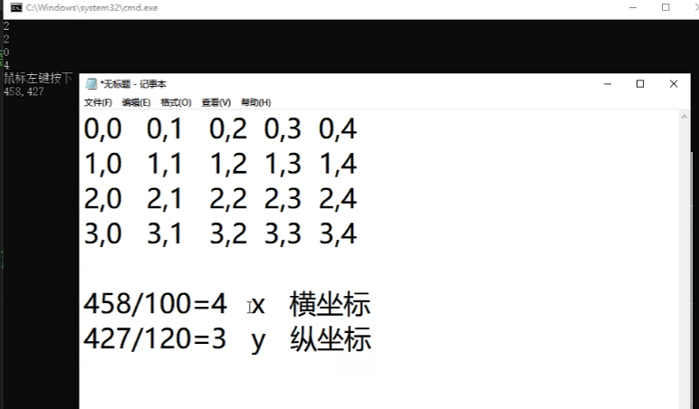
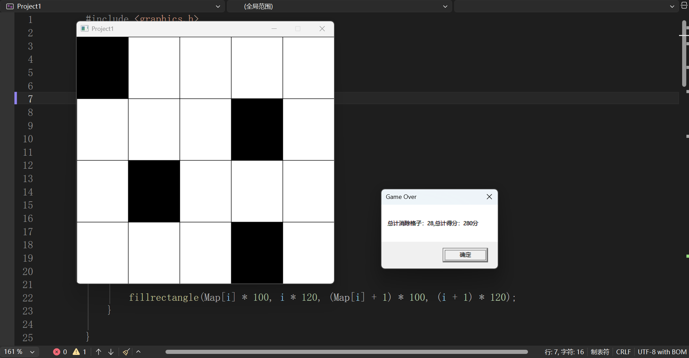

工具：
Visual Studio 


## 实现类似于钢琴块的功能
前四行是生成的每行随机的黑色块位置

点击左侧的区域，控制台显示触发的事件并显示坐标


利用取整来获取当前点击区域所属的块位置


点击最下方的一行，最上边更新
点到其他地方游戏结束。


## 代码实现
```c
#include <graphics.h>
#include <stdio.h>
#include<time.h>
#define N 5

int Map[N];//定义一个数组存储黑块的位置
int MapX, MapY;
int score = 0;
//随机产生黑块的坐标
void InitBlack() {
	for (int i = 0; i < N -1; i++) {
		Map[i] = rand() % N;//随机产生0-4的数
		printf("%d\n", Map[i]);
	}

}

//根据随机数组画出黑块
void DrawBlack() {
	for (int i = 0; i < N - 1  ; i++) {

		fillrectangle(Map[i] * 100, i * 120, (Map[i] + 1) * 100, (i + 1) * 120);
	}

}

//绘制界面
void Draw() {
	BeginBatchDraw();
	cleardevice();//清屏
	setfillcolor(WHITE);
	//本质格子就是矩形
	//fillrectangle(0, 0, 100, 120);
	setlinecolor(BLACK);
	for (int i = 0; i < 4; i++) {//行
		for (int j = 0; j < 5; j++) {//列
			fillrectangle(j * 100, i * 120, (j + 1) * 100, (i + 1) * 120);
		}
	}
	setfillcolor(BLACK);
	DrawBlack();
	EndBatchDraw();
}

bool Play() {
	ExMessage msg;// 定义一个 ExMessage 结构体变量来存储事件信息
	getmessage(&msg, EX_MOUSE);//getmessage 函数获取鼠标事件，并将事件信息存储在 msg 变量中
	switch (msg.message)  
	{
		case WM_LBUTTONDOWN: 
			MapY = msg.y / 120;//根据鼠标点击的坐标计算出点击的行数
			MapX = msg.x / 100;//根据鼠标点击的坐标计算出点击的列数
			if (Map[3] == MapX && MapY == 3) {//如果点击的坐标与黑块的坐标相同，则继续游戏
				for (int i = 3; i > 0; i--) {
					Map[i] = Map[i - 1];//将黑块的位置向下移动
				}
				Map[0] = rand() % N;//随机产生新的黑块位置
				score += 10;//得分增加10分
				printf("你点击到了黑块！\n");


			}
			else {
				 printf("你点击错了！游戏结束！\n");
				 return true;
			}
			break;
	}
	return false;
}
int main() {
	srand((unsigned)time(NULL));//通过时间做随机数种子
	SetConsoleOutputCP(GB2312_CHARSET);   // 设置控制台输出为 GB2312
	SetConsoleCP(CP_UTF8);        // 设置控制台输入为 UTF-8
	//1.创建图形界面
	//4行5列
	initgraph(500, 480);
	InitBlack();

	while (1) {
		Draw();
		if (Play()) {
			char str[128];
			snprintf(str, sizeof(str), "总计消除格子：%d,总计得分：%d分", score / 10, score);
			MessageBox(GetHWnd(), str, "Game Over", MB_OK);
			exit(0);
		}
	}
		//2.卡屏
		getchar();
		closegraph();
		return 0;
	

}

```
