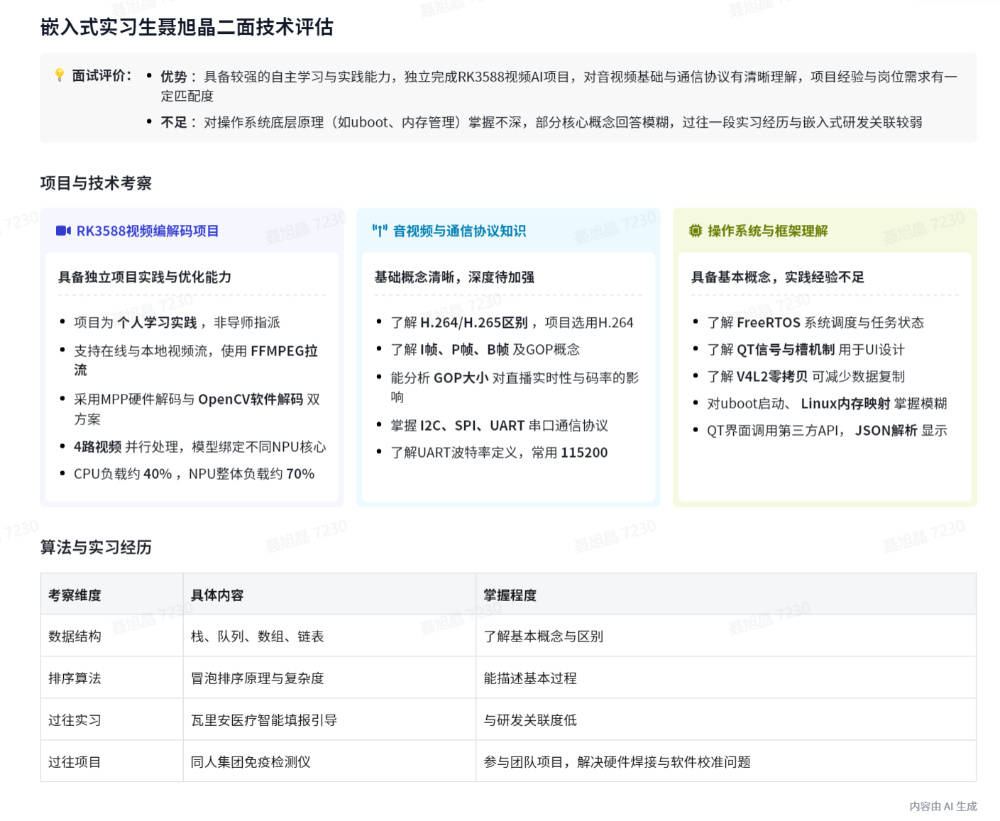

# 面试复盘

> 复制此文件来创建新的面试记录

---

## 面试前准备

### 基本信息
- **公司**：
- **岗位**：
- **面试时间**：04/17 17:00
- **面试形式**：（线上/线下/电话）
- **轮次**：（一面/二面/HR面）

### 公司调研
- 公司背景：
- 业务方向：
- 岗位要求分析：

### 预设问题准备
1. 自我介绍（1分钟/3分钟版本）
2. 为什么选这家公司？
3. 为什么选这个岗位？
4. 职业规划：

### 技术准备
- [ ] 复习相关技术栈
- [ ] 准备项目介绍（STAR法则）
- [ ] 预设技术问题：

### 提问环节准备
- 想问面试官的问题：

---

## 面试后复盘

### 实际面试问题记录

本次会议是李赞对聂旭晶的面试，围绕聂旭晶的学习、项目经验以及公司业务方向展开交流，内容如下：
- 聂旭晶个人情况
  - 学习背景
    - 教育经历：聂旭晶是北京理工大学生物学工程研二学生，本科有嵌入式实习经历，学过数电模电等课程。
    - 自主学习：虽研究生导师方向非嵌入式，但自己学习嵌入式知识，做了车载系统和 RK 3588 视频编解码项目。
  - 项目经验
    - 视频编解码项目：该项目为自主学习实践项目，可处理在线和本地视频流，采用 FMPEG MPEG 拉流，MPP 或 Opencv 解码，实现拉流解码、AI 推理及多模型融合输出。
    - 处理方式：优先用 MPB 硬解码缓解 CPU 压力，将大模型分成四个小模型并行处理，绑定不同 NPU 核心实现负载均衡，推流前做融合管理和旧帧废弃。
    - 技术了解：了解视频帧、264/265 区别、i 帧、b 帧、p 帧及 GOP 概念，知道 GOP 大小对直播的影响。
    - 其他项目：车载终端项目用于学习多传感器与 Linux 交互；在瓦里安医疗实习做低平台搭建智能填报引导智能体；用 Python 工具处理国家药品监督管理局网站数据；同人集团项目中一组实习生参与免疫层析试纸条检测仪项目。
  - 知识掌握
    - 通信协议：了解 I²C、SPI、URT 等通信协议，知道其特点和用途。
    - 系统知识：对 uboot 启动过程需深入学习，了解 Linux 系统调度，对内存管理相关知识记忆模糊。
    - 图形界面：基于 V4L2 框架设计零拷贝采集方案，利用 QT 设计集成化图形界面，调用第三方 API 获取天气、音乐、地图数据并解析显示。
    - 数据结构和算法：了解栈、队列、列表、数组等数据结构，知道冒泡排序算法。

- 公司业务方向
  - 业务内容：公司主要做 AI 玩具，目前有两款较急的 AI 玩具项目，基本功能为连接网络、与大模型对话，还涉及蓝牙、触摸等外设数据上传和下行控制。
  - 额外功能：产品可能有摄像头、触摸反应等额外操作，连接 AI 后有智能功能和性格养成等特点。
- 聂旭晶疑问
  - 岗位契合度：聂旭晶询问自己的能力与公司需求方向是否契合，李赞表示公司主要做 AI 玩具，虽未涉及具身机器人，但有机器人相关的传感器和舵机等。
  - AI 玩具知识：聂旭晶询问 AI 玩具具体涉及的知识，李赞介绍了联网、与大模型对话、控制协议、外设交互等方面的内容。

### 自我表现评估

| 维度 | 评分(1-5) | 说明 |
|------|----------|------|
| 技术回答 | | |
| 项目表达 | | |
| 沟通流畅度 | | |
| 应变能力 | | |

### 回答得失分析

**答得好的地方**：
- 

**答得不好的地方**：
- 

**完全不会的问题**：
- 

### 改进行动计划
- [ ] 补充学习：
- [ ] 优化项目介绍：
- [ ] 下次注意：

### 面试结果
- [ ] 等待中
- [ ] 通过，进入下一轮
- [ ] 拒绝
- **反馈总结**：

---

*记录时间：*